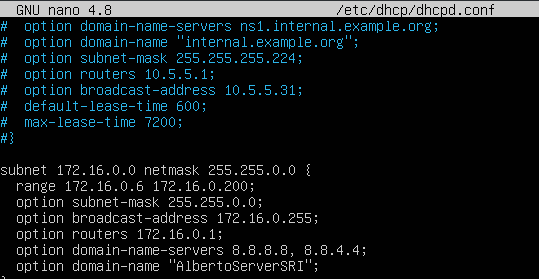
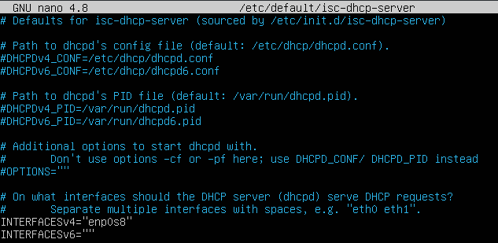
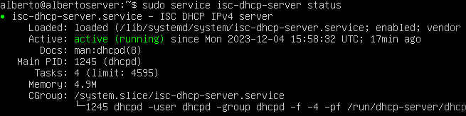
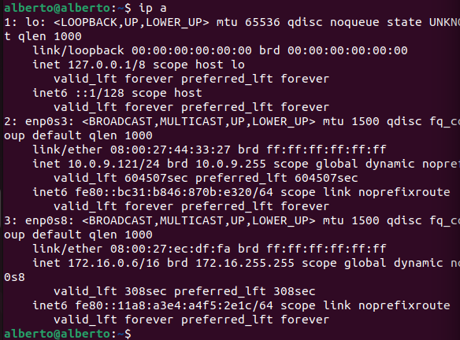
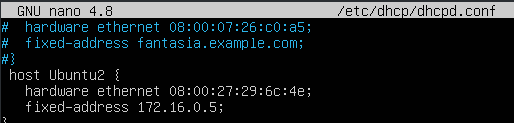
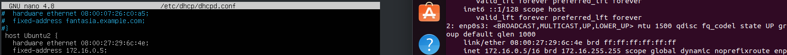

## Instalar paquete isc-dhcp-server
***Para la instalación del paquete isc-dhcp-server utilizaremos el siguiente comando:***

    sudo apt install isc-dhcp-server

## Editar para una configuración básica /etc/dhcp/dhcpd.conf
***Editamos la configuración de este archivo abriendolo con el editor de texto "nano" con el siguiente comando:***
    
    sudo nano /etc/dhcp/dhcpd.conf
***Una vez dentro añadimos la siguiente configuración:***

## Editar para configurar la interfaz de red /etc/default/isc-dchp-server
***Editamos la configuración de este archivo abriendolo con el editor de texto "nano" con el siguiente comando:***

    nano /etc/default/isc-dchp-server

***Una vez dentro añadimos la siguiente configuración:***

## Arranca el servicio con systemctl

## Comprueba el servicio con "systemctl status"
***Comprobamos el estado del servcio con el siguiente comando:***

    service isc-dhcp-server status

***Si todo funciona correctamente la salida del comado deberia dar el siguiente resultado***:

## Prueba con el cliente que se le asigna un ip en el rango 
***Accedemos al cliente y lanzamos el siguiente comando para comprobar que se le ha asignado correctamente una IP de nuestro rango**

    ip a

***La salida del comando nosdaría el siguiente resultado en el que vemos que se nos ha asignado la IP 172.16.0.6***

## Declarar una asignación por mac fija a 172.16.0.5
***Para declarar una IP por MAC accedemos al archivo /etc/dhcp/dhcpd.conf y añadimos la siguiente configuración:***

## Prueba con otro cliente que se le asigna la ip fija
***Accedemos al cliente y comprobamos que nuestra configuración ha tenido éxito utilizando el siguiente comando***

    ip a

***Si todo ha salido correctamente el comando nos deberia dar el siguiente resultado***

***Aqui comparamos la configuración del servidor con el resultado del comando en el cliente***